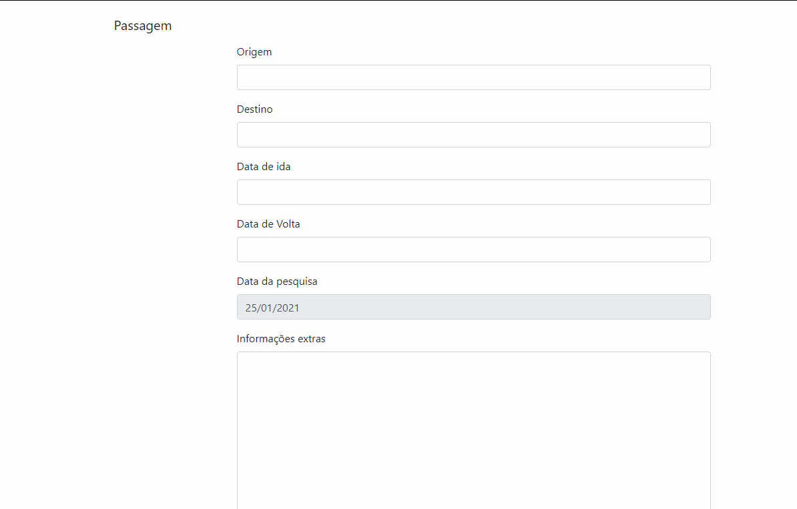

# Cursos da formação Django:
## Entendendo a Web por baixo dos panos
1-HTTP: Entendendo a web por baixo dos panos

2-Performance Web I: Otimizando o front-end

3-Performance Web II: Critical Path, HTTP/2 e Resource Hints

## Iniciando com Django
4-Introdução ao Django 3: Modelo, Rotas e Views

5-Integração de modelos no Django 3: Filtros, buscas e admin

## Sistemas de usuário e visualização de informações
6-Autenticação no Django 3: formulários, requisições e mensagens

7-Boas práticas no Django 3: apps, pastas e paginação

## Validação de formulários e deploy
8-Formulários no Django 3: criando e validando dados

## Artigos:
1-Django: Instalação, configuração e escrevendo seu primeiro app

2-Django: QuerySets e ORM

3-Fazendo o deploy de uma aplicação Django

## Vídeos extras:
1-Pipeline de Build com Docker e Azure
2-Deploy de uma aplicação Django com Docker

# Exemplo dos Projetos
Todos os projetos foram feitos em um ambiente virtual (venv)

## Aplicação web de receitas
- Aplicação de receitas onde é possivel visualizar e pesquisar as receitas;
- Cadastrar um usuário, realizar o login e visualizar sua própria página de receitas;
- CRUD das receitas

## Formulário de passagens
Uma uma aplicação de passagens focando na classe Forms do Django, criando, exibindo, estilizando e validado o formulário seguindo as principais convenções do Django.

